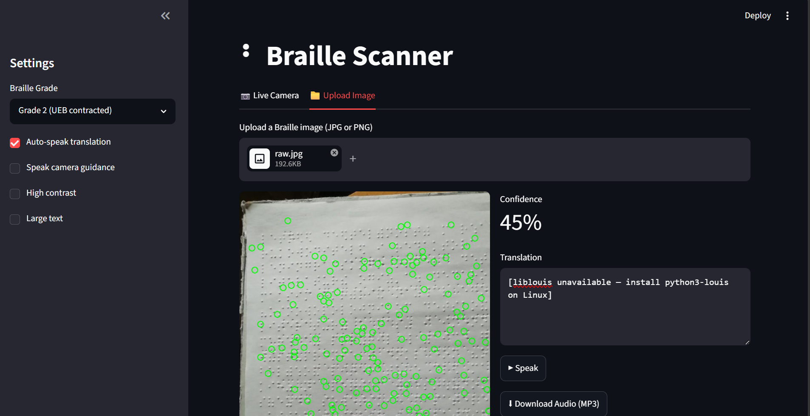
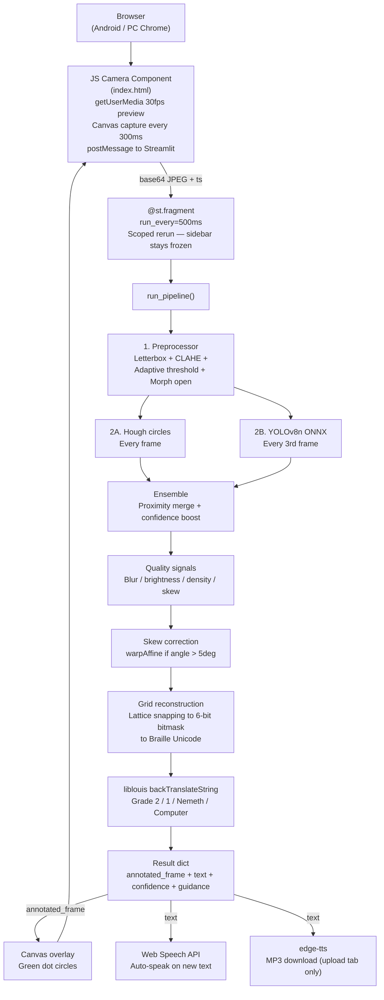

# Braille Scanner

A browser-based Braille OCR application that reads physical Braille through a phone or webcam and translates it to English text and speech in near real-time. Runs entirely on Streamlit Community Cloud's free tier — no paid infrastructure or server GPU required.

---

## Overview

Point a phone camera at any embossed Braille page. The app captures frames from the browser, runs a hybrid dot-detection pipeline on the Python server, and returns annotated overlays with translated text. Speech output plays immediately via the Web Speech API. For uploaded images, the same pipeline runs synchronously and offers an edge-tts MP3 download.

The app targets Android Chrome and PC Chrome/Edge/Firefox over HTTPS. iOS is not supported due to `getUserMedia` constraints in WKWebView.



*Figure — Upload preview: annotated image with detected dots and translated text.*

---


---

## Highlights

- **Ensemble dot detection** — Hough circle transform runs every frame for instant visual feedback; YOLOv8n ONNX inference runs every third frame to validate and confidence-boost Hough hits. Each detector compensates for the other's failure modes: Hough on clean well-lit paper, ONNX on blurred or low-contrast embossed dots.

- **Lattice-snapping grid reconstruction** — dot positions are snapped to an estimated spacing lattice rather than using only observed rows and columns. This preserves sparse cells where some of the six dots are absent, correctly reconstructing partial characters.

- **Adaptive image pipeline** — CLAHE clip limit is chosen dynamically based on measured frame brightness (dark: 3.5, bright: 1.0, normal: 2.0). Blur frames are held rather than processed. Memory pressure above 700 MB (detected via psutil) triggers a 640→480 input downscale.

- **Custom Streamlit component over raw postMessage** — the JS camera component uses the Streamlit component protocol directly with no CDN dependencies. `@st.fragment(run_every="500ms")` scopes server-side reruns to the camera fragment only, keeping sidebar and settings frozen.

- **Dual TTS paths** — the live tab speaks translations immediately through the Web Speech API (zero server latency). The upload tab generates a downloadable MP3 via Microsoft edge-tts with `en-US-JennyNeural`.

- **Four Braille grade tables** — Grade 2 UEB contracted (default), Grade 1 uncontracted, Nemeth math, and Computer 8-dot, all routed through liblouis `backTranslateString` with per-character `[?]` fallback on partial decode failures.

---

## Features

### Live Camera Mode
- Rear camera default on mobile (`facingMode: "environment"`)
- Front/rear toggle, pause/resume controls
- Green dot overlay drawn on the live video canvas
- Guidance messages updated each cycle: blur, brightness, distance, skew
- Auto-speak toggle: new translations spoken immediately via Web Speech API
- Optional spoken guidance (off by default to reduce noise)

### Upload Mode
- JPG/PNG file upload, same full pipeline as live mode
- Side-by-side view: annotated image with confidence metric and translation text box
- Speak button and MP3 download via edge-tts

### Pipeline
- Hough + YOLOv8n ONNX ensemble with proximity-based confidence boosting
- Skew correction: fits a regression line to each detected dot row, takes the median angle, applies `warpAffine` rotation when the angle exceeds 5°
- Quality gate: frames with Laplacian variance below 50 are held and the last valid result is returned
- ONNX graceful degradation: if the model file is absent, the app runs in Hough-only mode with a visible notice

### Accessibility
- High contrast mode: CSS-injected dark theme with high-contrast sidebar and metric labels
- Large text toggle: 1.4× font scale for the translation output

---

## Tech Stack

| Layer | Technology | Purpose |
|---|---|---|
| UI / server | Streamlit ≥ 1.37 | App framework, `@st.fragment` scoped reruns |
| Camera component | Vanilla JS + HTML5 | `getUserMedia`, canvas capture, Web Speech API, postMessage protocol |
| Image processing | OpenCV (headless) ≥ 4.9 | CLAHE, adaptive threshold, Hough circles, skew rotation |
| Dot detection | ONNX Runtime ≥ 1.17 | YOLOv8n nano FP32 inference on CPU |
| Grid math | NumPy ≥ 1.26 + SciPy ≥ 1.12 | Lattice snapping, spacing estimation, nearest-neighbor distances |
| Braille translation | liblouis (apt: python3-louis) | `backTranslateString` across 4 grade tables |
| Audio (server) | edge-tts ≥ 6.1 | MP3 generation for upload mode |
| Audio (client) | Web Speech API | Zero-latency auto-speak for live mode |
| Memory guard | psutil ≥ 5.9 | Monitors resident memory; triggers input downscale on free tier |
| Model training | YOLOv8n (Ultralytics) + Google Colab T4 | One-time fine-tune, exported to ONNX FP32 |
| Testing | pytest ≥ 8.0 | 50+ tests across all pipeline modules |

---

## Architecture



---

## How It Works

1. **Capture** — the JS component requests the rear camera via `getUserMedia` and captures a JPEG frame every 300 ms using an off-screen canvas. The base64-encoded frame and a millisecond timestamp are posted to Streamlit via `setComponentValue`.

2. **Preprocess** — the Python server letterboxes the frame to 640×640, converts to grayscale, applies CLAHE with a brightness-adaptive clip limit, Gaussian blurs, adaptive-thresholds, and morphologically opens the result to remove noise speckles.

3. **Detect** — Hough circle detection runs on the binary frame every cycle. On every third cycle, the preprocessed frame is also fed to the YOLOv8n ONNX session. An ensemble function merges the two detection lists by proximity: confirmed dots get a +0.15 confidence boost; Hough-only dots are included at a baseline 0.45 confidence.

4. **Correct** — if at least four dots are found and the median row angle exceeds 5°, the frame is rotated with `warpAffine` and detection re-runs on the corrected image.

5. **Reconstruct** — detected dot coordinates are snapped to an inferred spacing lattice. Each 2×3 dot slot in a Braille cell is mapped to a bit position; the six-bit bitmask is added to U+2800 to produce a Braille Unicode character. Multi-row pages produce newline-separated strings.

6. **Translate and speak** — the Braille Unicode string is passed to `louis.backTranslateString` using the user-selected grade table. The translation is sent back to the JS component, which updates the confidence bar, guidance message, and (if auto-speak is on) invokes the Web Speech API immediately.

---

## Setup

### Prerequisites

- Python 3.10+
- On Linux / Streamlit Community Cloud: liblouis available via apt
- On Windows (dev): translation returns `[liblouis unavailable]`; all other pipeline stages work and tests pass via mock

### Install

```bash
pip install -r requirements.txt
```

For liblouis (Linux only, required for translation):

```bash
sudo apt-get install liblouis-dev python3-louis
```

> Do not add `louis` to `requirements.txt` — there is no reliable pip package. The apt path is the stable install.

### Run locally

```bash
streamlit run app.py
```

The app opens at `http://localhost:8501`. Live camera mode requires HTTPS in most browsers; use the upload tab for local testing without an SSL certificate.

### Run tests

```bash
pytest
```

Tests mock liblouis so the full test suite passes on Windows and Linux without the apt package installed.

### Deploy to Streamlit Community Cloud

1. Fork the repo (must be public for Community Cloud).
2. Ensure `models/yolov8n_braille_combined.onnx` is committed (tracked via the `!models/*.onnx` gitignore exception).
3. `packages.txt` (`liblouis-dev`, `python3-louis`) is already present — Community Cloud installs apt packages from this file automatically.
4. Point Community Cloud at `app.py`.

### Re-train the model (optional)

```bash
# 1. Prepare YOLO dataset from Angelina + DSBI sources
python scripts/prepare_training_data.py \
    --angelina /path/to/AngelinaDataset \
    --dsbi /path/to/DSBI \
    --out data/braille_dots

# 2. Fine-tune (Google Colab T4 recommended)
yolo train model=yolov8n.pt data=braille_dots.yaml \
    epochs=100 imgsz=640 batch=16 \
    degrees=30 hsv_v=0.4 perspective=0.001

# 3. Export to ONNX
yolo export model=runs/detect/trainX/weights/best.pt format=onnx imgsz=640 opset=12
```

---

## Usage

### Live mode

Open the app in Android Chrome or PC Chrome over HTTPS. Navigate to the **Live Camera** tab. Point the rear camera at a Braille page. The guidance bar indicates adjustments needed (distance, lighting, tilt). Translation appears in the text area as dots are recognized; auto-speak reads it aloud if enabled.

Controls inside the camera component:
- **Pause / Resume** — stops JS frame capture without ending the camera stream
- **Flip** — switches between front and rear camera

### Upload mode

Open the **Upload Image** tab. Upload a JPG or PNG file. The pipeline runs once synchronously and displays:
- Annotated image with detected dots circled in green
- Confidence percentage
- Translation text
- Speak button (Web Speech API)
- Download Audio (MP3) button (edge-tts, `en-US-JennyNeural`)

### Braille grade selector (sidebar)

| Setting | Table | Use |
|---|---|---|
| Grade 2 (default) | `en-ueb-g2.ctb` | Standard contracted Braille (books, most published material) |
| Grade 1 | `en-ueb-g1.ctb` | Uncontracted, lossless letter-for-letter mapping |
| Nemeth | `nemeth.ctb` | Mathematical notation |
| Computer | `en-us-comp8-ext.utb` | 8-dot computer Braille |

---

## Key Decisions

| Decision | Rationale | Tradeoff |
|---|---|---|
| Custom JS component instead of streamlit-webrtc | streamlit-webrtc requires a paid TURN server on Community Cloud; raw `getUserMedia` + postMessage works over HTTPS at zero cost | Component is ~200 lines of vanilla JS with no external libraries; must handle postMessage protocol manually |
| Hough + ONNX ensemble rather than ONNX alone | Hough runs every frame for immediate visual feedback; ONNX fires every 3rd frame for higher-accuracy validation. Each covers the other's failure modes | Two code paths to maintain; ensemble proximity threshold (8px) is a tunable parameter |
| `@st.fragment(run_every=...)` for live updates | Without fragments, every `setComponentValue()` call from JS triggers a **full app rerun**, making 2–3 Hz video processing unsustainable on the free tier. With `@st.fragment(run_every="500ms")`, only the fragment's code reruns — the rest of the app (sidebar, settings, static UI) stays frozen. This is the standard 2025 Streamlit pattern for streaming/real-time data and was stabilised in v1.37. |
| liblouis via apt, not pip | `pip install louis` is unreliable across platforms; `python3-louis` from apt provides stable bindings | Translation returns `[liblouis unavailable]` on Windows dev machines; lazy import design keeps the module importable everywhere |
| Lattice-snapping grid instead of cluster-only | Pure row/column clustering loses empty dot slots in sparse cells. Snapping to an estimated pitch preserves the correct bit position for every dot | Spacing estimation degrades on very sparse frames (fewer than ~4 dots); minimum dot threshold is configurable |
| psutil memory guard + 640→480 downscale | Community Cloud free tier is capped at ~1 GB RAM. Detected via `psutil.virtual_memory()` at runtime | Downscaled frames reduce ONNX accuracy slightly; ONNX is disabled entirely on 480px frames to avoid resolution mismatch |
| Models trained on Angelina + DSBI combined | Single-dataset model (Angelina only) gave near-zero confidence on real images; combining ~500 paired examples (290 Angelina + 228 DSBI) improved reliability | ~500 training images is a small corpus; confidence scores are lower than large-scale detectors, so threshold is 0.25 rather than the standard 0.4 |

---

## Notable Engineering

**Lattice-preserving cell reconstruction** — `grid.py` estimates the dot spacing from the observed point cloud using a combination of axis-sorted unique values and nearest-neighbor distances. Each dot is then assigned an integer lattice index via `numpy.rint`. This means a lone bottom-right dot in an otherwise empty cell still maps to bit 5 (dot 6), not bit 0. The test `test_reconstruct_grid_preserves_single_dot_position` specifically validates this: a single dot at an offset position must produce the correct Unicode codepoint, not the first one.

**Ensemble confidence model** — the ensemble function is asymmetric by design. An ONNX detection confirmed by a nearby Hough dot gets a +0.15 boost (capped at 1.0). A Hough-only dot with no ONNX match is included at a fixed 0.45, but only if its radius is plausible (3–15px). An ONNX-only dot passes through at its raw confidence. This hierarchy reflects the observation that the two detectors have complementary failure modes.

**Split TTS architecture** — live mode uses the Web Speech API in the JS component, which means translation audio plays without any server round-trip. Upload mode uses edge-tts server-side because the uploaded image is already in a single-shot flow where an async wait is acceptable and a downloadable file is useful. The two paths were kept separate rather than standardizing on one, because collapsing them would either add latency to live mode or add complexity to the component protocol.

**Adaptive CLAHE** — clip limit is not a constant. `brightness()` (mean pixel intensity) is measured on the raw grayscale frame before preprocessing. Frames below brightness 40 use clip 3.5 to recover shadow detail; frames above 210 use clip 1.0 to suppress overexposure artifacts; normal frames use 2.0. This single conditional produces measurably better Hough results in varied lighting without requiring a separate exposure-correction stage.

---

## Roadmap

- **Client-side ONNX inference via WebGPU** — running the YOLOv8n model in the browser with ONNX Runtime Web would remove the server bottleneck entirely and enable true 10+ FPS annotated output. The design spec documents this as the primary future pivot. Liblouis back-translation would still require a server call.

- **INT8 static quantization** — `onnxruntime.quantization.quantize_static` with ~50 calibration images would reduce the 12 MB FP32 model to ~6 MB and improve CPU inference throughput. The `yolo export int8=True` flag has known issues; the quantization API path is the reliable route.

- **Multi-line page scanning** — the current grid reconstructor handles multiple rows but the confidence signal is averaged across the whole frame. Per-line confidence scoring would allow partial translations of large pages where only part of the frame is in focus.

- **Grade auto-detection hint** — while full auto-detection is unsound before a grade is known, a heuristic based on the proportion of high-contraction cells (e.g., presence of ⠮ or ⠯) could suggest switching to Grade 2 if the user is on Grade 1.

- **iOS support** — `getUserMedia` works in Safari on iOS 14.3+ and in Chrome on iOS via WKWebView with the `mediaDevices` flag. Adding camera compatibility for iOS would broaden the accessible user base significantly.

---

## About

Built to explore what a practical accessibility tool looks like within the constraints of free hosting — no GPU, no paid services, no native app distribution. The central engineering challenge was keeping the pipeline accurate enough to be genuinely useful while fitting within a 1 GB RAM envelope and building camera streaming without the infrastructure that WebRTC normally requires.

Braille datasets: [AngelinaDataset](https://github.com/IlyaOvodov/AngelinaDataset) · [DSBI](https://github.com/yeluo1994/DSBI)
